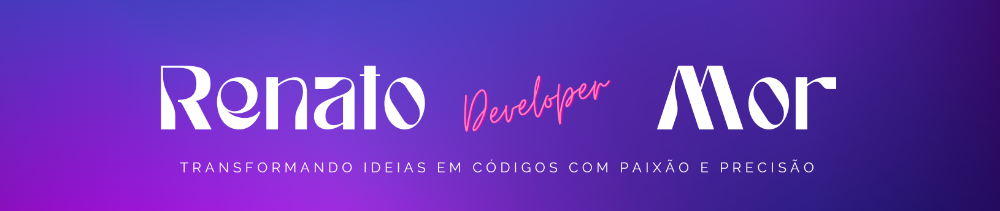

 
  

<h1 align="center">Formação GitHub Certification</h1>

<h2 align="center">Projeto AZ-900 Certification: Nuvem em Ação</h2>

 
  

<h5> I ❤️ Back-End Development!</h5>

<h3 >Encontre-me :handshake: </h3>

    
    
    
</a>
    
    
    

 

## Menu

- [Descrição à computação em nuvem](#descrição-à-computação-em-nuvem)
- [Objetivos de aprendizado](#objetivos-de-aprendizado)
- [Pré-requisitos](#pré-requisitos-footprints)
- [Introdução aos fundamentos do Microsoft Azure](#introdução-aos-fundamentos-do-microsoft-azure---footprints)
- [Fundamentos do Azure](#fundamentos-do-azure)
- [Vantagens em fazer o Azure Fundamentals](#vantagens-em-fazer-o-azure-fundamentals)
- [Licença](#licença-traffic_light)
- [Agradecimentos](#agradecimentos-tada)

## Descrição à computação em nuvem

Este módulo apresenta a computação em nuvem. Abrange coisas como conceitos de nuvem, modelos de implantação e compreensão da responsabilidade compartilhada na nuvem.

## Objetivos de aprendizado

Após a conclusão deste módulo, adquiri conhecimentos e habilidade para ser capaz de:

- Definir computação em nuvem.

- Descreva o modelo de responsabilidade compartilhada.

- Definir modelos de nuvem, incluindo pública, privada e híbrida.

- Identificar casos de uso apropriados para cada modelo de nuvem.

- Descrever o modelo baseado em consumo.

Comparar modelos de preços de nuvem.

## Pré-requisitos

- Familiaridade básica com termos e conceitos de TI.

- Conhecimentos básicos de sistemas operacionais, especialmente Windows.

- Habilidades de navegação na web e uso de ferramentas online.

## Introdução aos fundamentos do Microsoft Azure

O Microsoft Azure é uma plataforma de computação em nuvem com um conjunto de serviços em constante expansão para ajudá-lo a criar soluções que atendam às suas metas de negócios. Os serviços do Azure oferecem suporte a tudo, do simples ao complexo. O Azure possui serviços Web simples para hospedar a presença de sua empresa na nuvem. O Azure também suporta a execução de computadores totalmente virtualizados, gerenciando suas soluções de software personalizadas. O Azure oferece diversos serviços baseados em nuvem, como armazenamento remoto, hospedagem de banco de dados e gerenciamento centralizado de contas. O Azure também oferece novos recursos, como serviços focados em inteligência artificial (IA) e Internet das Coisas (IoT).

Nesta série, você abordará noções básicas de computação em nuvem, conhecerá alguns dos principais serviços fornecidos pelo Microsoft Azure e aprenderá mais sobre os serviços de governança e conformidade que pode usar.

## Fundamentos do Azure

Fundamentos do Azure é uma série de três roteiros de aprendizagem que familiarizam você com o Azure e seus diversos serviços e recursos.

Se você está interessado em serviços de computação, rede ou armazenamento; aprender sobre as melhores práticas de segurança na nuvem; ou explorando opções de governança e gerenciamento, pense nos Fundamentos do Azure como seu guia selecionado para o Azure.

O Azure Fundamentals inclui exercícios interativos que proporcionam experiência prática com o Azure. Muitos exercícios fornecem um ambiente de portal temporário do Azure chamado sandbox, que permite praticar a criação de recursos de nuvem gratuitamente no seu próprio ritmo.

Não é necessária experiência técnica em TI; no entanto, ter conhecimentos gerais de TI o ajudará a aproveitar ao máximo sua experiência de aprendizado.

## Vantagens em fazer o Azure Fundamentals

Se você está apenas começando a trabalhar com a nuvem ou se já tem experiência na nuvem, o Azure Fundamentals fornece tudo o que você precisa para começar.

Não importa quais sejam seus objetivos, o Azure Fundamentals tem algo para você. Você deve fazer este curso se:

- Tenha interesse geral no Azure ou na computação em nuvem
- Deseja obter a certificação oficial da Microsoft (AZ-900)

A série de roteiros de aprendizagem Fundamentos do Azure pode ajudá-lo a se preparar para o Exame AZ-900: Fundamentos do Microsoft Azure. Este exame inclui três áreas de domínio de conhecimento:

| Área de domínio de conhecimento                | Peso   |
| ---------------------------------------------- | ------ |
| Descrever conceitos de nuvem                   | 25-30% |
| Descrever a arquitetura e os serviços do Azure | 15-20% |
| Descrever a gestão e governação do Azure       | 25-30% |

Cada área de domínio é mapeada para um caminho de aprendizagem no Azure Fundamentals. Os percentuais apresentados indicam o peso relativo de cada área no exame. Quanto maior a porcentagem, mais questões essa parte do exame conterá. Certifique-se de ler a página do exame para obter detalhes sobre quais habilidades são abordadas em cada área.

Este treinamento ajuda você a desenvolver uma compreensão ampla do Azure.

## Licença

Este projeto está licenciado sob a Licença consulte o arquivo
[MIT](https://opensource.org/licenses/MIT).

## Agradecimentos

_**Digital Innovation One**_

Agradeço à Digital Innovation One por proporcionar recursos educacionais valiosos que contribuíram para o desenvolvimento dos meus projetos.

_**Azure**_

Expresso minha gratidão à equipe do Microsoft Azure por oferecer uma plataforma robusta e escalável para hospedar e gerenciar aplicativos em nuvem. A eficiência e confiabilidade do Azure são fundamentais para o sucesso de muitos projetos.

_**VS Code**_

Agradeço à equipe do Visual Studio Code pelo incrível editor que facilita o desenvolvimento deste projeto.

_**Microsoft**_

Agradeço à equipe da Microsoft por suas contribuições inovadoras para o mundo da tecnologia. Sua dedicação ao desenvolvimento de software e serviços tem impactado positivamente a comunidade global de desenvolvedores.

_**GitHub**_

Agradeço à equipe do GitHub por fornecer uma plataforma de desenvolvimento colaborativo que facilita o compartilhamento de projetos.

Copyright © 2024 / RenatoMor
